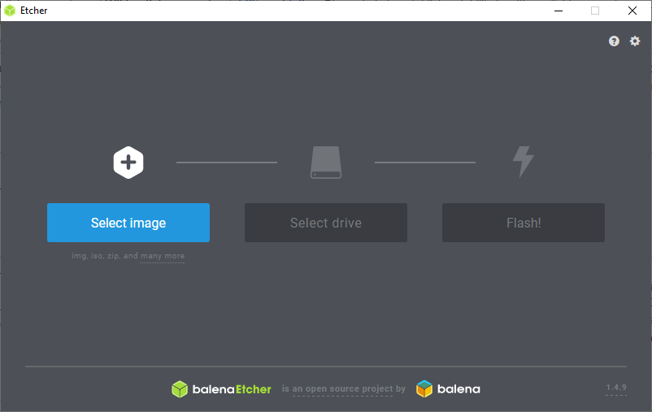

# Using my Laptop as a personal homelab

​I had a laptop lying around, collecting dust and never being used. I decided to repurpose it by installing Ubuntu Server and then running a variety of Docker containers on it. This will be a tutorial on how to set that up.

The first thing is installing Ubuntu Server, I used an external HDD of 1TB in order to get this type of storage (planning to upgrade to an SSD).

I also removed the internal SSD that's on my laptop so the installation of Ubuntu Server won't mistakenly try to install on my SSD (highly recommended to do!)

