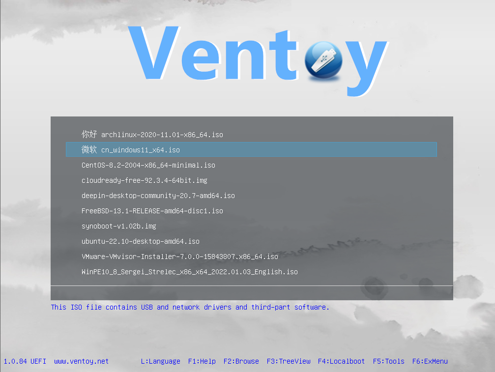

# Using my Laptop as a personal homelab

​I had a laptop lying around, collecting dust and never being used. I decided to repurpose it by installing Ubuntu Server and then running a variety of Docker containers on it. This will be a tutorial on how to set that up.

The first thing is installing Ubuntu Server, I used an external HDD of 1TB in order to get this type of storage (planning to upgrade to an SSD).

I also removed the internal SSD that's on my laptop so the installation of Ubuntu Server won't mistakenly try to install on my SSD (highly recommended to do!)


I personally use BelenaEtcher but you can use Rufus aswell! 

(Link to belena and Rufus)

Also, another great option is burning ventoy, a great iso manager inside the boot drive itself, I use it a lot and it's much easier and faster if you have many images 



Once you're in the bootable you would need to setup a few things:
1. OpenSSH
2. Wireless connection (useful for emergencies)
3. Partitions just make full use of your external HDD

After that let it do it's magic and once it's done you got yourself an Ubuntu Server! 
Now once you're inside you should try to make sure you can connect to OpenSSH it would usually be ssh your_username@local_ip and the password is the one you wrote in the beginning. 

Once we've done all of this I highly recommend using tailscale for making your private network abroad from anywhere in the world for you, tailscale is a service that let's you connect multiple of your devices in a privated VPN of your own with the option to even host certain ports! 

 

You can install it by first making sure your server is up to date by writing
```bash
sudo apt-get update -qq && sudo apt-get upgrade -y -qq
```

Once we've made sure all is updated we can do:
```bash
sudo apt install tailscale
```
