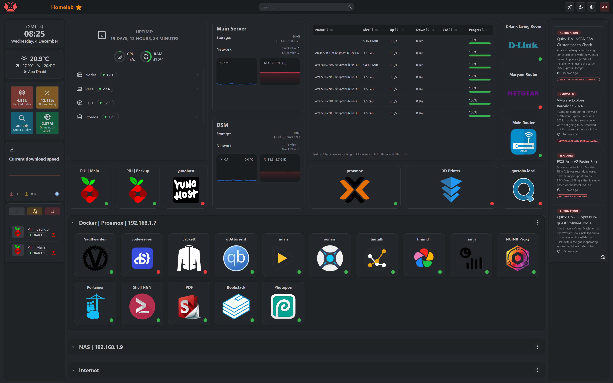
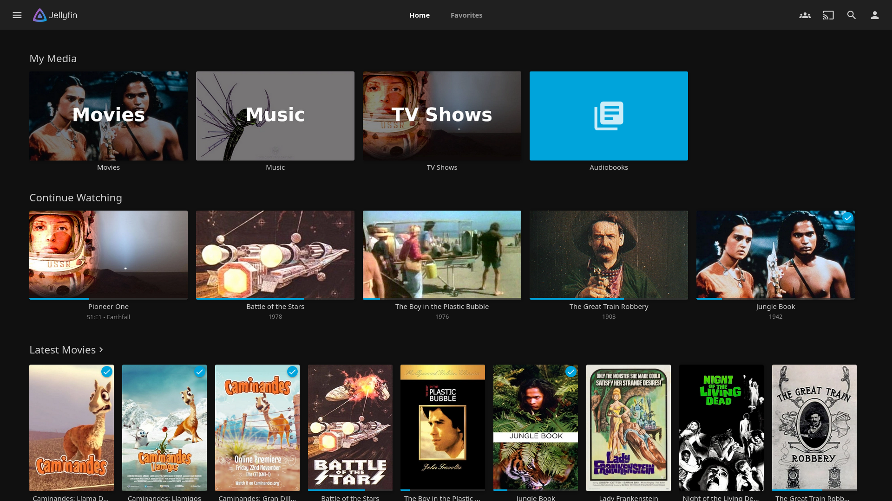
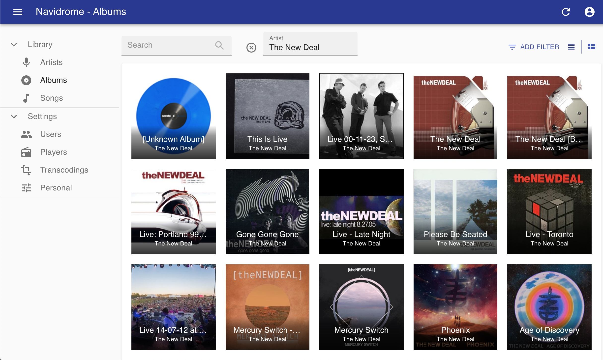

# Using my Laptop as a personal homelab

​I had a laptop lying around, collecting dust and never being used. I decided to repurpose it by installing Ubuntu Server and then running a variety of Docker containers on it. This will be a tutorial on how to set that up.

The first thing is installing Ubuntu Server, I used an external HDD of 1TB in order to get this type of storage (planning to upgrade to an SSD).

I also removed the internal SSD that's on my laptop so the installation of Ubuntu Server won't mistakenly try to install on my SSD (highly recommended to do!)


I personally use BelenaEtcher but you can use Rufus aswell! 

(Link to belena and Rufus)

Also, another great option is burning ventoy, a great iso manager inside the boot drive itself, I use it a lot and it's much easier and faster if you have many images 


Once you're in the bootable you would need to setup a few things:
1. OpenSSH
2. Wireless connection (useful for emergencies)
3. Partitions just make full use of your external HDD

After that let it do it's magic and once it's done you got yourself an Ubuntu Server! 
Now once you're inside you should try to make sure you can connect to OpenSSH it would usually be ssh your_username@local_ip and the password is the one you wrote in the beginning. 

Once we've done all of this I highly recommend using tailscale for making your private network abroad from anywhere in the world for you, tailscale is a service that let's you connect multiple of your devices in a privated VPN of your own with the option to even host certain ports! 

 

You can install it by first making sure your server is up to date by writing
```bash
sudo apt-get update -qq && sudo apt-get upgrade -y -qq
```

Once we've made sure all is updated we can do:
```bash
sudo apt install tailscale -y
```

Then, you need to connect the server to the services you can do it with 
```bash
sudo tailscale up
```
It will send you a link that you would need to enter on another device and login. Once you've done that you can use that same IP to connect to your homelab from anywhere in the world!

Now lets start by setting up Docker
```bash
curl -fsSL https://get.docker.com -o get-docker.sh
sudo sh get-
rm get-docker.sh
sudo usermod -aG docker $USER
```
after inputting all these commands you should be able to start Docker using:
```bash
sudo systemctl enable --now docker
```

After that all that's left is just installing all the containers you want! I personally reccomend the following ones:

## Homarr - Dashboard for all your Docker container in one place!
This is my goto first container I install. It's easier to manage other containers, see their statuses and also have an easy access to enter them and manage all of my containers.

 
One line command to install it:
```bash
mkdir -p $(pwd)/homarr/configs $(pwd)/homarr/icons && \
docker run -d \
  --name homarr \
  --restart unless-stopped \
  -p 7575:7575 \
  -v $(pwd)/homarr/configs:/app/data/configs \
  -v $(pwd)/homarr/icons:/app/public/icons \
  ghcr.io/ajnart/homarr:latest
```

## Jellyfin - All in one Netflix replacement! Excellent for watching your saved shows and movies in one place from anywhere in the world!
I personally don't enjoy paying for 100 different subscriptions to watch my favorite shows, however with Jellyfin I can experience a similar Netflix vibes and enjoy all of my shows/movies/animes in one place!

 
One line command to install it:
```bash
mkdir -p $(pwd)/jellyfin/config $(pwd)/jellyfin/cache /home/$USER/media/movies /home/$USER/media/shows && \
docker run -d \
  --name jellyfin \
  --restart unless-stopped \
  -p 8096:8096 \
  -v $(pwd)/jellyfin/config:/config \
  -v $(pwd)/jellyfin/cache:/cache \
  -v /home/$USER/media:/media \
  jellyfin/jellyfin:latest
```

## Navidrome - Excellent and lightweight replacement for Spotify/YoutubeMusic! 
This one is being used on a daily basis, all my music albums are saved locally and I can listen to them from anywhere!

 
One line command to install it:
```bash
mkdir -p $(pwd)/navidrome/data /home/$USER/media/music && \
docker run -d \
  --name navidrome \
  --restart unless-stopped \
  -p 4533:4533 \
  -v $(pwd)/navidrome/data:/data \
  -v /home/$USER/media/music:/music:ro \
  deluan/navidrome:latest
```
